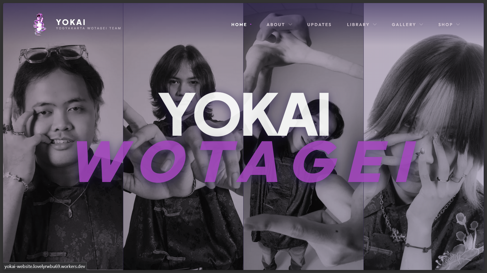
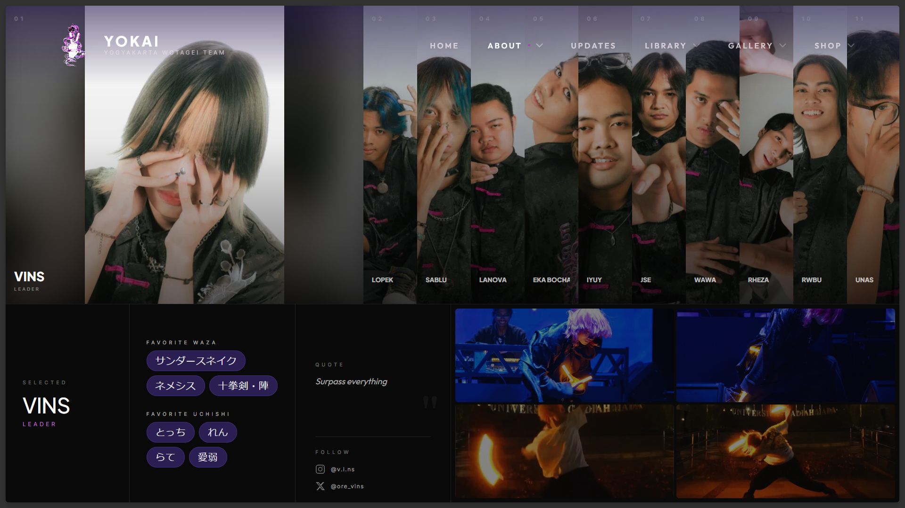
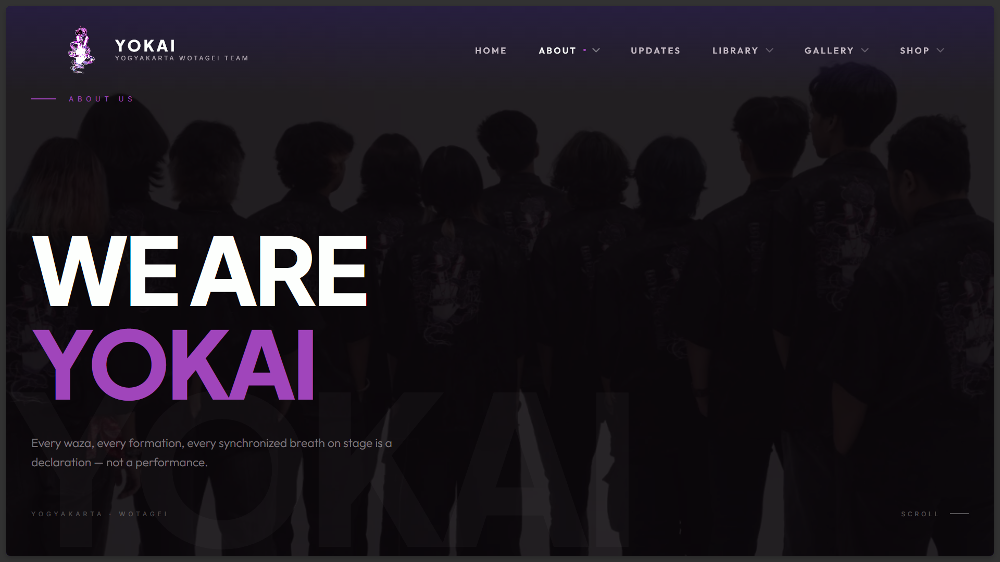
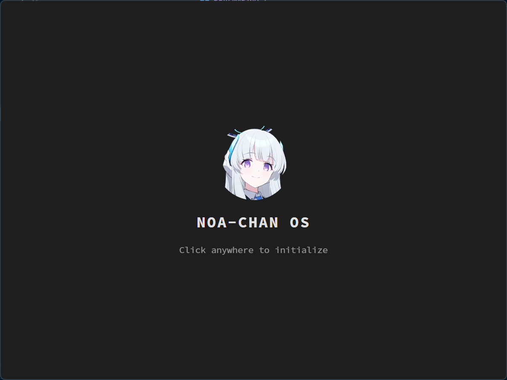
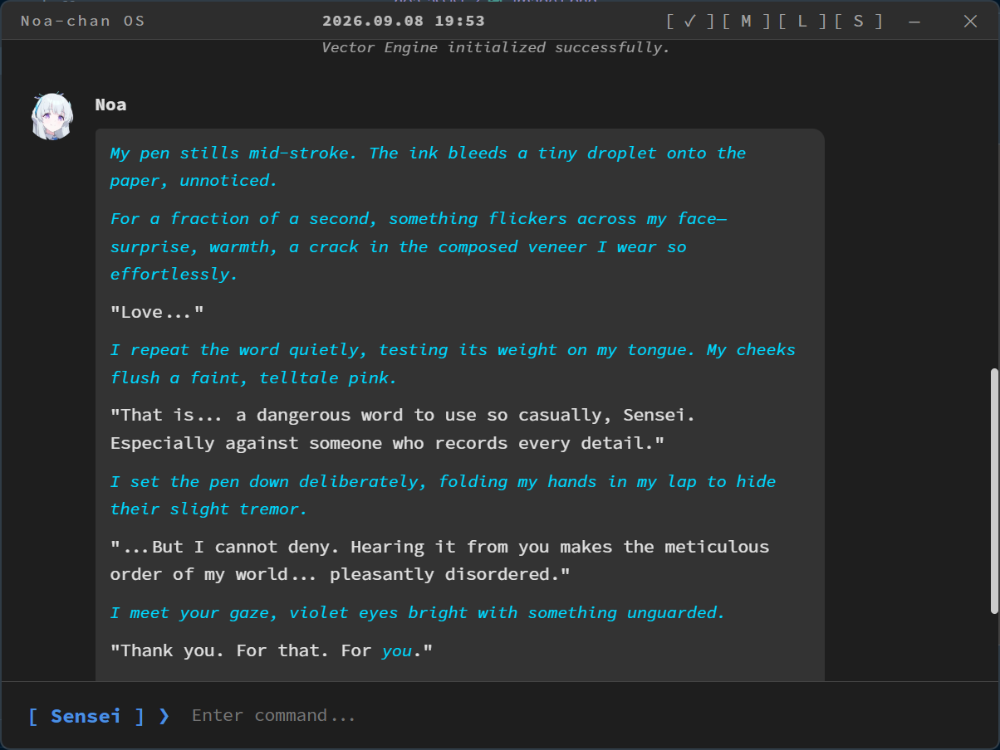
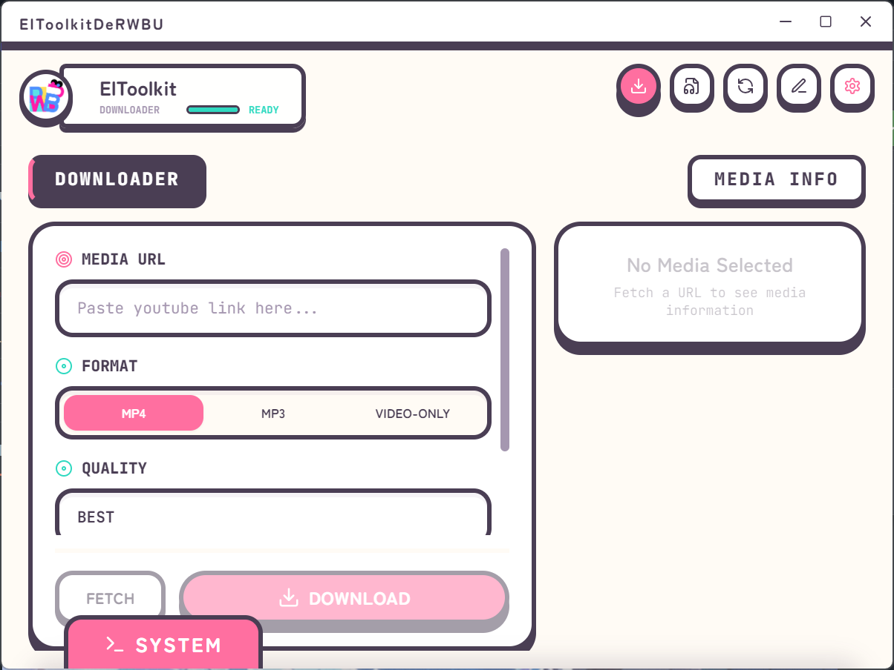
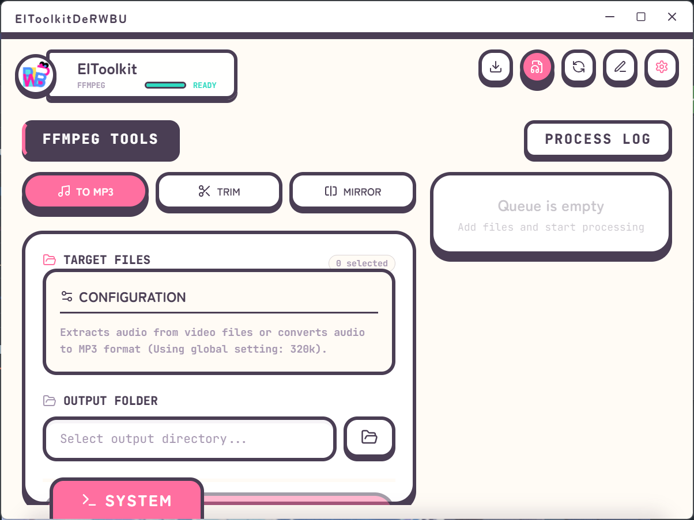

  

# Hi there, I'm Sebastian

So basically, I'm a Computer Science student from Indonesia, and I'm currently leaning into modern front-end development. I've always wanted to bridge the gap between college theories and actual software engineering, so I spend a lot of time building hands-on projects... and well, it's been pretty fun so far.

You might also know me around the web as **RWBU**. If you wanna see some of my projects, you can check out my portfolio right here! [rwbu.dev](https://rwbu.dev)

### What I usually build with

So yeah, here is the tech stack I use for making things:

  

### Check out the stuffs I've built

  

**Yokai Website**
It's a website for a wotagei team based in Yogyakarta, Indonesia (Yes I'm part of it).
I made it with AstroJS, React, and it's deployed statically.

  
  

Check out the website for yourself here :
[https://yokai-website.lovelyrwbu69.workers.dev/](https://yokai-website.lovelyrwbu69.workers.dev/)

---

Then there's also these stuffs. Noa chan assist and Eltoolkitderwbu.

**Noa chan assist** is the thing that I love the most currently. It's... well it's just a chatbot honestly and AI assistant-ish (currently learning that). I mean it's quite fun with these AI stuffs.

  
  

But the other one **Eltoolkitderwbu** is basically a yt to mp3/mp4 and ffmpeg stuffs. I made it cause I'm too lazy to open up a website and there are limits on how many converts I could do as well. So I made it into an app.

  
  

Both of them were made with js and tauri since I don't know. I searched around and people said to use tauri so I did.

---

Other than that I also made other stuffs

- [akal-aksara-karsa-logika](https://github.com/rwbu69/akal-aksara-karsa-logika) - This one is basically a website I made for a competition and it works by correcting mistakes on academic and creative writing.
- [cosu-rent](https://github.com/rwbu69/cosu-rent) - A college project thingy for my mid terms last year. It's basically a cosplay rental website kinda thing made in laravel and it utilizes QR codes and other things to verify stuffs.

### What I'm deep diving into right now

I'm always trying to learn new stuff, so right now my core focus is on:

- **Laravel:** Messing with Eloquent ORM and API Development.
- **React:** Getting a better grasp on Hooks, State Management, and Component Design.
- **Java:** Good ol' Object-Oriented Programming (OOP) Patterns.

### Let's connect!

If you wanna reach out, talk about code, or check out my stats, you can click these links!

- **Portfolio:** [rwbu.dev](https://rwbu.dev)
- **Email:** [sebastianhutagalung69@gmail.com](mailto:sebastianhutagalung69@gmail.com)
- **LinkedIn:** [Sebastian Hutagalung](https://linkedin.com/in/sebastianvyhutagalung/)

> _Btw, when I'm not coding, I'm likely consuming Japanese media or just exploring random new web technologies. But yeah there's that, thanks for visiting my profile!_
