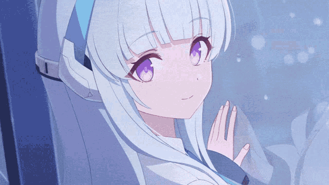

---

---

## 📖 About Me
- 👨‍💻 **Sebastian**, Computer Science Student  
- 📍 **Indonesia** 🇮🇩  
- 💫 Interests: Programming, Anime, Gaming, Tech  

---

## 🌱 Currently Learning
| Language/Framework | Focus Area | Progress |
|:------------------:|:----------:|:--------:|
| **PHP** | Laravel | 🟦🟦🟦⬜⬜ |
| **JavaScript** | React.js | 🟦🟦🟦🟦⬜ |
| **Java** | OOP Concepts | 🟦🟦🟦⬜⬜ |

---

## ⚡ Tech Stack

**Frontend:** React, JavaScript, HTML5, CSS3  
**Backend:** PHP (Laravel), Java  
**Tools:** Git, Composer, Vite, Tailwind  

---

|  |  |
|---|---|

---

